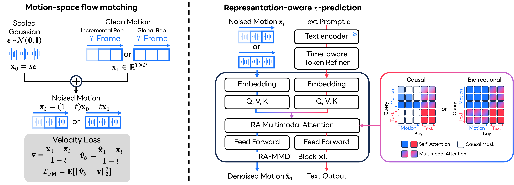

# MSFlow

This repository contains materials developed by LY Corporation and has been temporarily open-sourced for [our research project](https://yu1ut.com/MSFlow-HP/).
 
- **Temporary Release**: This repository is temporarily available as open-source. Therefore this repository may be turn into read-only or private anytime.
- **Attribution**: All code and materials in this repository are owned by LY Corporation.

## Project Overview

Code of the paper "MotionSpaceFlow: Representation-Aware Flow Matching in Direct Motion Space". 
*MotionSpaceFlow (MSFlow) generates full-resolution motion directly, without a learned motion encoder or decoder.*
<div align="center">


[](https://arxiv.org/abs/2609.34190)
[](https://yu1ut.com/MSFlow-HP/)
[](http://creativecommons.org/publicdomain/zero/1.0/)
</div>

## ⚙️ Getting Started
<details>
<summary><b>Installation, pretrained models, and data</b></summary>

### 1. Set Up the Python Environment Using uv
```bash
uv sync
```

### 2. Download Models

#### Download Evaluation Models
Download **glove** to the `glove` folder and **t2m_evaluators** to the `checkpoints` folder from the [MARDM](https://github.com/neu-vi/MARDM) repository for robust 67-dimensional evaluation.

#### Download Pretrained Models
Download the pretrained models from [Hugging Face](https://huggingface.co/ly-corporation/MSFlow) and place them in `checkpoints/t2m/`.

### 3. Obtain the Data
Download the **HumanML3D** dataset from the [HumanML3D repository](https://github.com/EricGuo5513/HumanML3D). Extract it into the `datasets` folder.


The complete directory structure should look like this:
```
sample-code
│   README.md
│   pyproject.toml
|   ...
|
└───glove
└───train
└───...
│   
└───datasets
|    └───HumanML3D
|       └───new_joint_vecs
|       └───...
│   
└───checkpoints
     └───t2m
          └───text_not_match
          └───text_not_match_clip
          └───MMDiT_pretrained
          └───MMDiT_xyz_pretrained
```
</details>

## 🎬 Demo
<details>
<summary><b>Demo scripts</b></summary>
Run the pretrained 263-dimensional model with:

### Text-to-motion generation
```bash
uv run python -m sample.demo_msflow_263 name=MMDiT_pretrained
```

Run the pretrained XYZ model with:

```bash
uv run python -m sample.demo_msflow_xyz name=MMDiT_xyz_pretrained 
```

Additional Hydra overrides such as `input_text`, `prompt_csv`, `num_samples`,
and `exp` can be appended to either command.

### Joint-controlled XYZ sampling

The joint-control launcher uses `MMDiT_xyz_pretrained` and generates the `kick`,
`walk`, `cartwheel`, and `run_circle` examples sequentially on one GPU:

```bash
bash sample/demo_joint_control.sh
```

Outputs are written to
`generations/joint_control/<action>/`.

</details>

## 🔥 Train and evaluate MSFlow
<details>
<summary><b>Train MSFlow models</b></summary>

### 263-dimensional representation

```bash
uv run python -m train.train_msflow_263 name=<exp_name>
```

### XYZ representation

```bash
uv run python -m train.train_msflow_xyz name=<exp_name>
```
</details>

<details>
<summary><b>Evaluate MSFlow models</b></summary>

### 263-dimensional representation

```bash
uv run python -m eval.eval_msflow_263 name=<exp_name>
```
Use `name=MMDiT_pretrained` to evaluate the pretrained model.

### XYZ representation

```bash
uv run python -m eval.eval_msflow_xyz name=<exp_name>
```
Use `name=MMDiT_xyz_pretrained` to evaluate the pretrained model.
</details>

## Acknowledgements

Some parts of our code are based on [ACMDM](https://github.com/neu-vi/ACMDM) and other third-party software listed in [NOTICE.txt](NOTICE.txt).

## Citation

```bibtex
@article{yu2026msflow,
  title={MotionSpaceFlow: Representation-Aware Flow Matching in Direct Motion Space},
  author={Yu, Qing and Fujiwara, Kent},
  journal={arXiv preprint arXiv:2609.34190},
  year={2026}
}
```

## Contributions
 
As this project is temporarily open-sourced, we are not accepting contributions. For feedback or inquiries, please open an issue in this repository.

## License
 
This code is dedicated to the public domain under [CC0 1.0](https://creativecommons.org/publicdomain/zero/1.0/). 
You may copy, modify, and distribute it without restriction, and the authors make no warranties or guarantees regarding its use.

Additionally, this repository contains third-party software. Refer to [NOTICE.txt](NOTICE.txt) for more details, and follow the applicable terms and conditions.
